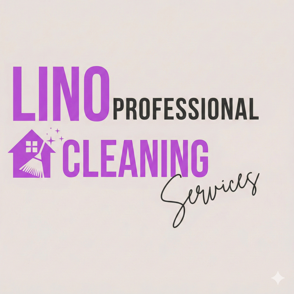
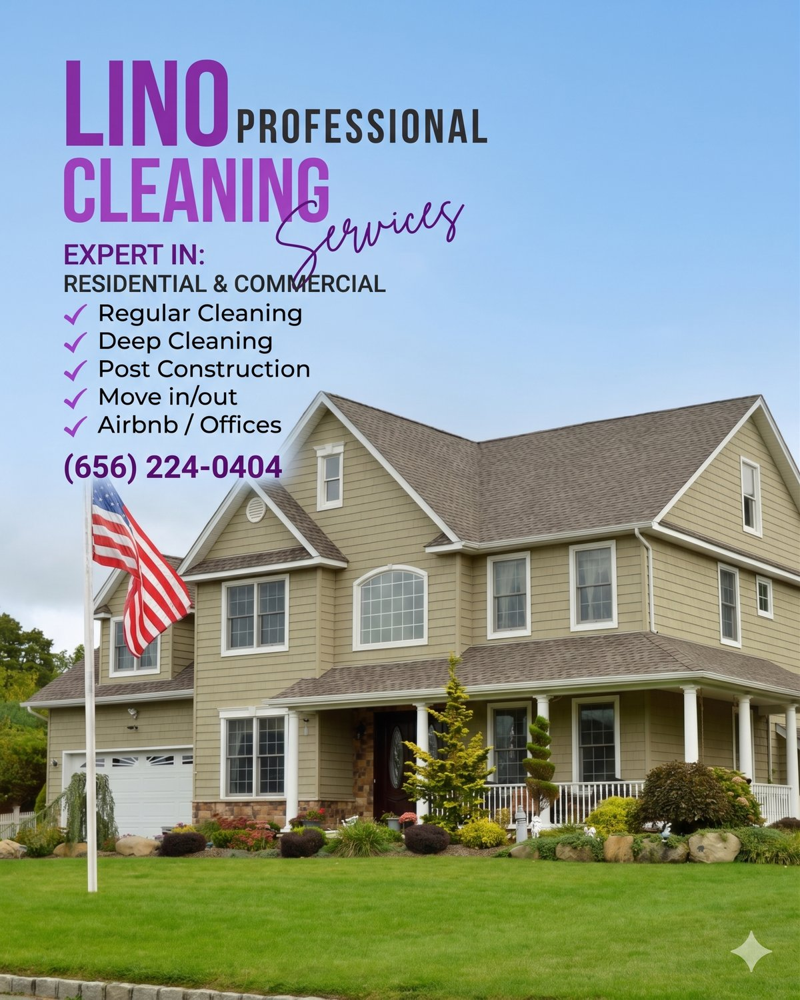
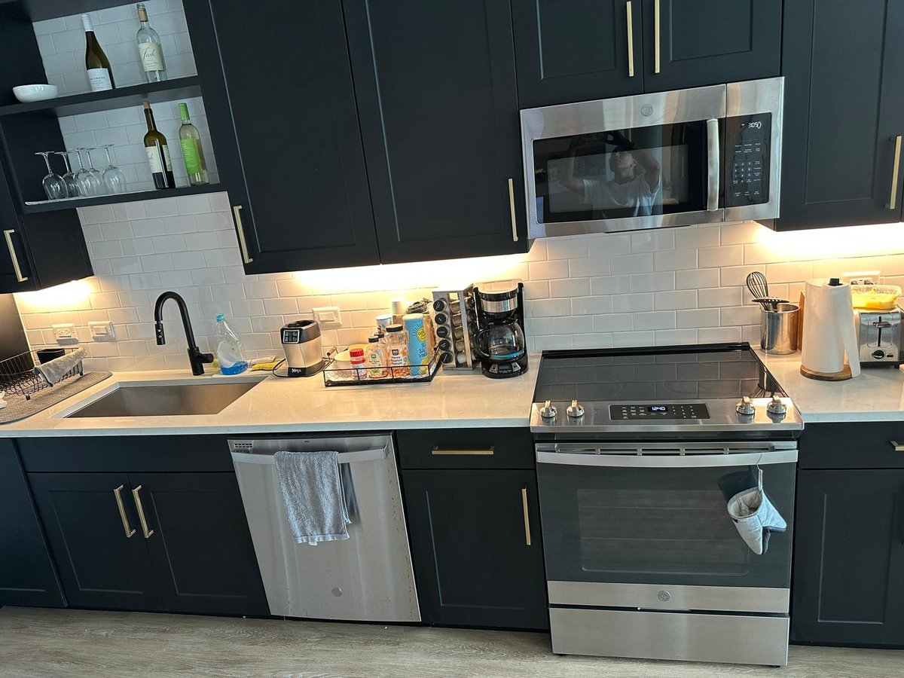

# Assets — Imagens reais da Lino (já baixadas do Drive)

Todas as 11 imagens abaixo **já estão na pasta `assets/`**, baixadas da pasta "2 - Lino Professional Clean Services" do Drive da Spartus Digital. Otimizadas para web.

## Mapeamento completo (nome do arquivo → onde usar)

| Arquivo | Onde aparece no site | Tamanho | Dimensão |
|---|---|---|---|
| `logo.png` | Header + footer (PNG transparente) | 165 KB | original |
| `hero.jpg` | Background / lateral do Hero section | 111 KB | otimizado |
| `service-recurring.jpg` | Card "Recurring Cleaning" (quarto) | 333 KB | 4:3 |
| `service-deep.jpg` | Card "Deep Cleaning" (cozinha) | 320 KB | 4:3 |
| `service-movein.jpg` | Card "Move-In/Out" | 269 KB | 4:3 |
| `service-postconstruction.jpg` | Card "Post-Construction" | 226 KB | 4:3 |
| `service-airbnb.jpg` | Card "Airbnb / Short-Term Rentals" | 322 KB | 4:3 |
| `service-office.jpg` | Card "Office & Commercial" | 334 KB | 4:3 |
| `bathroom.jpg` | Galeria extra / "Why Choose Us" (opcional) | 55 KB | 4:3 |
| `team.jpg` | Seção "About Us" ou "Why Choose Us" — time da Lino | 134 KB | 16:10 |
| `van.jpg` | Seção "Service Area" ou footer — van/transporte | 122 KB | 16:10 |

**Total:** ~2.4 MB (excelente para web).

## Instruções de uso no HTML

Sempre referenciar imagens com caminho relativo:
```html



```

- Sempre definir `width` e `height` (evita layout shift — bom pro Core Web Vitals).
- Usar `loading="lazy"` em TODAS as imagens **exceto** o hero.
- `alt` descritivo, incluindo "Tampa" ou a cidade quando fizer sentido (bônus SEO).

## Favicon

A cliente não mandou um favicon dedicado. Gerar a partir de `assets/logo.png`:

1. Ir em https://favicon.io/favicon-converter/
2. Fazer upload de `assets/logo.png`
3. Baixar o zip e colocar no root do site: `favicon.ico`, `apple-touch-icon.png`, `android-chrome-192x192.png`, `site.webmanifest`

Adicionar no `<head>`:
```html
<link rel="icon" type="image/x-icon" href="favicon.ico">
<link rel="apple-touch-icon" sizes="180x180" href="apple-touch-icon.png">
<link rel="icon" type="image/png" sizes="32x32" href="favicon-32x32.png">
```

## OG image (preview em redes sociais)

Criar `assets/og-image.jpg` com **1200x630 px** — pode ser o `team.jpg` com overlay do logo + headline "House Cleaning Tampa, FL · Free Quote". Ferramenta simples: Canva ou https://og-playground.vercel.app/

## Ícones de UI

Usar **Lucide Icons** via CDN — não faz sentido imagem para ícones pequenos:
```html
<script src="https://unpkg.com/lucide@latest"></script>
<script>lucide.createIcons();</script>
```
Uso: `<i data-lucide="sparkles"></i>`, `<i data-lucide="shield-check"></i>`, etc.

## Se quiser adicionar mais depois

Na pasta do Drive ainda tem **vídeos curtos** que podem virar pequenos loops no site (bathroom cleaning, mirror cleaning, etc.). Se a cliente aprovar, adicionar uma seção "See us in action" com 1-2 vídeos autoplay/muted.

Arquivos de vídeo no Drive (não baixados ainda — decidir depois):
- `bathroom-cleaning.mp4`
- `mirror-and-glass-streak-free-cleaning.mp4`
- `spring-cleaning-service-for-busy-families.mp4`
- `window-cleaning-service-interior-exterior.mp4`
- `professional-cleaning-supplies-and-equipment.mp4`
- `last-minute-house-cleaning-booking.mp4`
